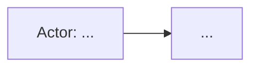
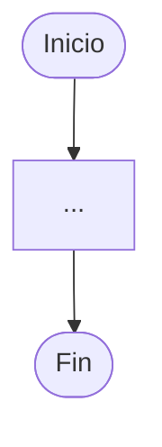
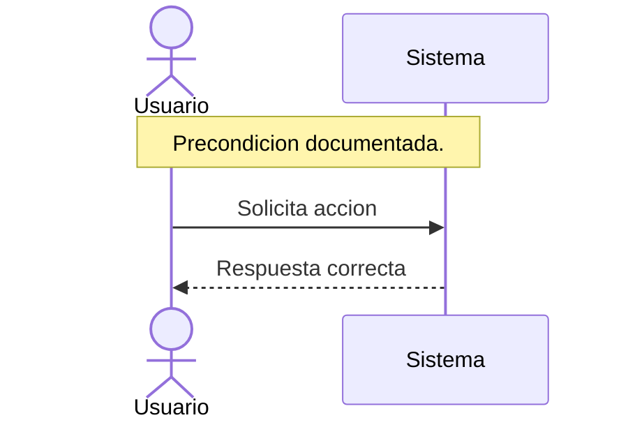
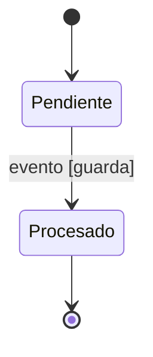

# booster-uml

Generar `openspec/changes/<CHANGE_ID>/uml-diagrams.html` con diagramas UML trazables a los artefactos del change. Responder y documentar en espanol siempre que sea posible; conservar en ingles comandos, rutas, keywords Mermaid, endpoints, roles, claims y terminos tecnicos establecidos.

## Flujo

1. Resolver `CHANGE_ID` desde la peticion o desde los cambios abiertos de OpenSpec si viene invocado por `native-ai uml`.
2. Trabajar desde la raiz del proyecto y localizar `openspec/changes/<CHANGE_ID>/`.
3. Leer, si existen:
   - `proposal.md`
   - `tasks.md`
   - `design.md`
   - todos los `specs/**/spec.md`
4. Si falta algun artefacto, anotarlo como hueco y continuar con los disponibles.
5. Extraer antes de escribir diagramas:
   - actores primarios y secundarios
   - objetivo del change
   - requisitos normativos `SHALL`, `MUST`, criterios de aceptacion y comportamientos obligatorios
   - escenarios `WHEN`/`THEN`, acceptance criteria, casos de prueba y flujos alternativos
   - entidades o agregados con ciclo de vida
   - componentes, servicios, endpoints, jobs, modelos, tablas y sistemas externos
   - precondiciones, invariantes, decisiones tecnicas e inconsistencias entre documentos
6. Generar el contenido final en el orden obligatorio.
7. Renderizarlo a HTML con `scripts/render_uml_html.py` y guardarlo exactamente como `openspec/changes/<CHANGE_ID>/uml-diagrams.html`, siempre en UTF-8.
8. Informar al usuario de la ruta generada, huecos relevantes y cualquier supuesto importante.

No modificar `proposal.md`, `tasks.md`, `design.md` ni `specs/**/spec.md`.

## Reglas De Codificacion

- Tratar toda entrada Markdown y salida HTML como UTF-8.
- El HTML final debe conservar `<meta charset="utf-8">` y escribirse con `encoding="utf-8"`.
- Usar `--input <markdown-file>` para contenido en espanol con acentos, enes o signos invertidos, guardando el Markdown temporal con `Set-Content -Encoding utf8` en PowerShell.
- No usar `Out-File` ni redirecciones intermedias sin `-Encoding utf8`.
- Antes de finalizar, verificar que `uml-diagrams.html` no contiene secuencias compatibles con mojibake como `U+00C3`, `U+00C2`, `U+00E2 U+20AC` o `U+FFFD`.
- Si `render_uml_html.py` informa mojibake no reparable, corregir la fuente Markdown o el artefacto OpenSpec y volver a renderizar. No entregar HTML con mojibake conocido.

## Salida Obligatoria

El HTML debe contener este orden exacto:

1. Encabezado con el ID del change.
2. Resumen de 2-3 frases del proposito del change.
3. Lista de supuestos asumidos y huecos en la documentacion fuente.
4. Diagrama de casos de uso con titulo, parrafo explicativo de maximo 4 lineas y bloque Mermaid.
5. Diagrama de actividad con titulo, parrafo explicativo de maximo 4 lineas y bloque Mermaid.
6. Diagramas de secuencia: minimo happy path y maximo 3 escenarios criticos, cada uno con titulo, parrafo explicativo y bloque Mermaid.
7. Diagrama de estado con titulo, parrafo explicativo y bloque Mermaid.
8. Tabla de trazabilidad con columnas `Requisito/Escenario` y `Diagrama(s) donde aparece`.

## Reglas Mermaid

- Casos de uso: usar `flowchart LR` o `graph LR`. Mermaid no tiene use-case nativo.
- Actividad: usar `flowchart TD`; usar `subgraph` como swimlanes cuando haya mas de un participante.
- Secuencia: usar `sequenceDiagram`; usar `actor` para personas o roles humanos y `participant` para sistemas.
- Estado: usar `stateDiagram-v2`; si no hay maquina explicita, indicarlo en el parrafo y proponer la minima coherente como supuesto.
- Evitar `<<include>>` y `<<extend>>` dentro de Mermaid. Etiquetar aristas como `include` y `extend`.
- Evitar `<`, `>`, `&`, URLs con query strings, comillas internas y llamadas con parentesis en mensajes Mermaid.
- Mantener etiquetas cortas y legibles.
- Mantener cada diagrama cerca de 20 nodos. Si excede, dividir en subdiagramas numerados.
- No inventar actores, estados, endpoints ni componentes. Si algo es necesario para completar el diagrama, declararlo como supuesto.
- Cada requisito `SHALL`/`MUST` o acceptance criterion importante debe aparecer en al menos un diagrama o quedar explicado en trazabilidad.

## Plantilla De Contenido

Usar esta estructura como borrador antes de renderizar:

````markdown
# Diagramas UML - <CHANGE_ID>

Resumen de 2-3 frases.

## Supuestos y huecos

- Supuesto: ...
- Hueco: ...

## Casos de uso

Parrafo breve.



## Actividad

Parrafo breve.



## Secuencia 1 - Happy path

Parrafo breve.



## Estado

Parrafo breve.



## Trazabilidad

| Requisito/Escenario | Diagrama(s) donde aparece |
|---|---|
| ... | ... |
````

## Renderizado HTML

Usar el script incluido para envolver el Markdown con Mermaid en un HTML navegable. Para evitar mojibake en Windows, preferir un Markdown temporal UTF-8 y `--input`:

```powershell
$tmp = New-TemporaryFile
@'
# Diagramas UML - auth-security

...
'@ | Set-Content -LiteralPath $tmp -Encoding utf8
python .agents\skills\booster-uml\scripts\render_uml_html.py --change-id auth-security --input $tmp --output openspec\changes\auth-security\uml-diagrams.html
```

El script lee desde stdin por defecto y decodifica bytes como UTF-8, pero en Windows `stdin` puede llegar degradado por la shell antes de Python. Para documentacion en espanol, usar `--input <markdown-file>`.

## Checklist

Antes de finalizar, verificar:

- Todos los artefactos disponibles fueron leidos o se marco su ausencia.
- No hay actores, componentes, estados o endpoints inventados sin supuesto explicito.
- Los bloques Mermaid evitan tokens HTML reservados y sintaxis problematica para Mermaid 11+.
- Hay entre 1 y 3 diagramas de secuencia.
- La maquina de estados explicita o propuesta queda identificada.
- La tabla de trazabilidad cubre los requisitos y escenarios principales.
- El fichero `uml-diagrams.html` existe en el directorio del change.
- El fichero `uml-diagrams.html` esta en UTF-8 y no contiene mojibake detectable.
